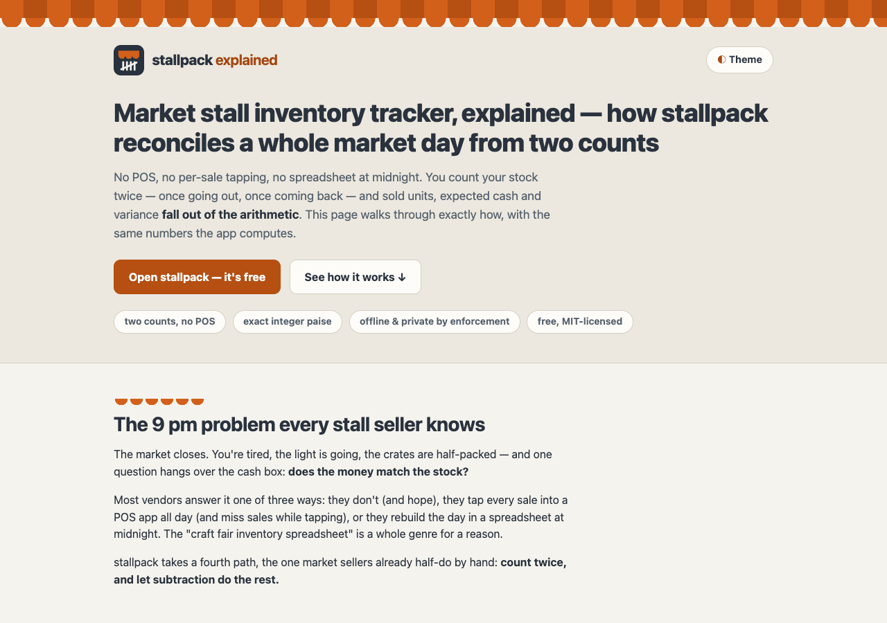

# stallpack explained — how the market stall inventory tracker works

**An animated, single-page walkthrough of [stallpack](https://sreenivas-sadhu-prabhakara.github.io/stallpack/):
how two physical counts — pack out in the morning, count back in the evening — become
sold units, expected takings and an honest cash variance, entirely in the vendor's own
browser.**



- **This explainer:** https://sreenivas-sadhu-prabhakara.github.io/stallpack-explained/
- **The live app it explains:** https://sreenivas-sadhu-prabhakara.github.io/stallpack/
  ([app source](https://github.com/Sreenivas-Sadhu-Prabhakara/stallpack))

## What's on the page

- **The 9 pm problem** — why POS apps and midnight spreadsheets fail market sellers.
- **An animated 4-stage walkthrough** of one day at the Tuesday haat: pack out, the
  90-second return count, `sold = carried − returned`, and the variance verdict — with
  bars that grow as you scroll (pure CSS + inline SVG, no libraries).
- **A live one-item demo** — steppers and price/takings inputs running the same
  integer-paise engine the page's self-tests prove; returned is clamped to carried.
- **The enforced-privacy section** — an animated diagram of a request bouncing off
  `connect-src 'none'`: the browser itself blocks any send; it is policy, not promise.
- **Feature tour, honest limits and FAQ** — including, prominently, that variance is
  arithmetic and **not theft detection**.

`prefers-reduced-motion` collapses every animation to its final, fully legible state.
Light and dark themes are both WCAG-AA; everything is keyboard-operable.

## Quickstart

No build step, no dependencies.

```sh
git clone https://github.com/Sreenivas-Sadhu-Prabhakara/stallpack-explained.git
cd stallpack-explained
open index.html        # or serve statically: python3 -m http.server 8000
```

Run the self-tests (Node 20+):

```sh
node --test
```

The tests re-derive the two-count arithmetic in `data/reconcile.js` — the same worked
example shown on the page and the OG card (30 carried, 12 back, 18 sold, ₹2,700.00
expected, ₹140.00 short) — plus rupee parsing, Indian digit grouping, sell-through
rounding, and a 2000-run seeded property test of the paise identities.

## Privacy

Same guarantee as the app it explains: this page ships a strict Content-Security-Policy
with `connect-src 'none'`, so **the browser itself blocks every network request**. No
server, no account, no analytics, no external fonts or scripts. The only thing stored
is your theme choice, in this browser's `localStorage`.

## Disclaimer

This explainer and stallpack are record-keeping aids provided **"as is"**, without
warranty of any kind. stallpack is not accounting, tax, or professional business advice;
its figures are only as accurate as the counts and amounts entered, and its variance
figure is arithmetic — discounts, haggling, freebies, breakage, miscounts and theft are
indistinguishable in it. It never accuses. Verify important numbers yourself. The author
accepts no liability for decisions made using these tools.

## License

[MIT](LICENSE) © 2026 Sreenivas Sadhu Prabhakara
